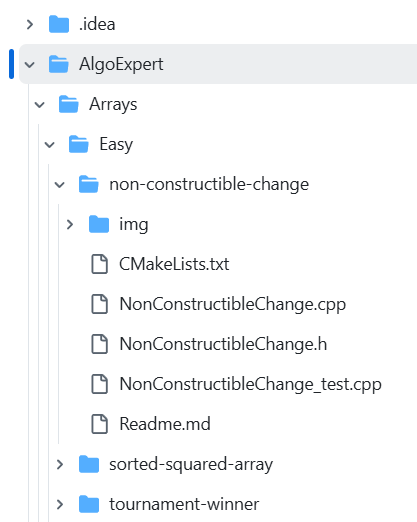

## algoexpert-cpp

Solving [algoexpert](https://www.algoexpert.io/questions) problems in C++.

Some notes:

*   The repo is structured like **Algoexpert** (**AE**) by problems categories

    *   Categories (like “**Arrays**”, “**Heaps**”, “**Strings**”, etc.) are divided to difficulty levels (**Easy**, **Medium**, **Hard**, **Very Hard**)
        *   And finally - problems themself for each level  

*   Example:

    

    **AlgoExpert** - root directory

    **Arrays** - category

    **Easy** - level

    **NonConstructibleChange** - problem dir with a set of files with straightforward names (\*.cpp - solution, \_test.cpp - test cases, etc.)  

        
    
*   Test cases
    *   Originally **AE** test cases is not a clear part that intended to be exposed and/or exported to your framework/code. It just some kind of raw meta coded things that may help if you debug a code right on the site
    *   So I've created additional python scripts project (it is not a part of this repo) which parses AE meta-test-cases and transforms them to Google Test modules (almost all problems contains corresponding \*\_test.cpp module in a problem directory)
    *   However, not all such meta-test-cases are easy convertible (BST problems, class methods, etc.). Such problems were solved in place on site (sure not so clear as with a set of local tests)

### Current status of solved/total problems:

*   102 Questions Completed out of 200
*   By categories:

<table>
    <tbody>
        <tr>
            <td>
                &nbsp;
            </td>
            <td>
                <strong>Category</strong>
            </td>
            <td>
                <strong>Solved / Total</strong>
            </td>
        </tr>
        <tr>
            <td style="text-align:right;">
                1
            </td>
            <td>
                Arrays
            </td>
            <td>
                27 / 33
            </td>
        </tr>
        <tr>
            <td style="text-align:right;">
                2
            </td>
            <td>
                Binary Search Trees
            </td>
            <td>
                9 / 12
            </td>
        </tr>
        <tr>
            <td style="text-align:right;">
                3
            </td>
            <td>
                Binary Trees
            </td>
            <td>
                0 / 17
            </td>
        </tr>
        <tr>
            <td style="text-align:right;">
                4
            </td>
            <td>
                Dynamic Programming
            </td>
            <td>
                13 / 21
            </td>
        </tr>
        <tr>
            <td style="text-align:right;">
                5
            </td>
            <td>
                Famous Algorithms
            </td>
            <td>
                1 / 9
            </td>
        </tr>
        <tr>
            <td style="text-align:right;">
                6
            </td>
            <td>
                Graphs
            </td>
            <td>
                0 / 15
            </td>
        </tr>
        <tr>
            <td style="text-align:right;">
                7
            </td>
            <td>
                Greedy Algorithms
            </td>
            <td>
                0 / 6
            </td>
        </tr>
        <tr>
            <td style="text-align:right;">
                8
            </td>
            <td>
                Heaps
            </td>
            <td>
                0 / 5
            </td>
        </tr>
        <tr>
            <td style="text-align:right;">
                9
            </td>
            <td>
                Linked Lists
            </td>
            <td>
                11 / 15
            </td>
        </tr>
        <tr>
            <td style="text-align:right;">
                10
            </td>
            <td>
                Recursion
            </td>
            <td>
                11 / 15
            </td>
        </tr>
        <tr>
            <td style="text-align:right;">
                11
            </td>
            <td>
                Searching
            </td>
            <td>
                2 / 9
            </td>
        </tr>
        <tr>
            <td style="text-align:right;">
                12
            </td>
            <td>
                Sorting
            </td>
            <td>
                0 / 9
            </td>
        </tr>
        <tr>
            <td style="text-align:right;">
                13
            </td>
            <td>
                <a href="http://Algoexpert/Stacks">Stacks</a>
            </td>
            <td>
                10 / 11
            </td>
        </tr>
        <tr>
            <td style="text-align:right;">
                14
            </td>
            <td>
                Strings
            </td>
            <td>
                18 / 18
            </td>
        </tr>
        <tr>
            <td style="text-align:right;">
                15
            </td>
            <td>
                Tries
            </td>
            <td>
                0 / 5
            </td>
        </tr>
    </tbody>
</table>
