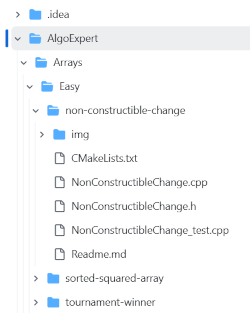

## algoexpert-cpp

Solving [algoexpert](https://www.algoexpert.io/questions) problems in C++.

Some notes:

*   The repo is structured like **Algoexpert** (**AE**) by problems categories

    *   Categories (like “**Arrays**”, “**Heaps**”, “**Strings**”, etc.) are divided to difficulty levels (**Easy**, **Medium**, **Hard**, **Very Hard**)
        *   And finally - problems themself for each level  

*   Example:

    

    **AlgoExpert** - root directory

    **Arrays** - category

    **Easy** - level

    **NonConstructibleChange** - problem dir with a set of files with straightforward names (\*.cpp - solution, \_test.cpp - test cases, etc.)  

        
    
*   Test cases
    *   Originally **AE** test cases is not a clear part that intended to be presented and/or exported to your framework/code. It just some kind of raw meta code things that may help if you debug a code right on the site
    *   So I've created additional python scripts project (it is not a part of this repo) which parses AE meta-test-cases and transforms them to Google Test modules (almost all problems contains corresponding \*\_test.cpp module in a problem directory)
    *   However, not all such meta-test-cases are easy convertible (BST problems, class methods, etc.). Such problems were solved in place on site (sure not so clear as with a set of local tests)